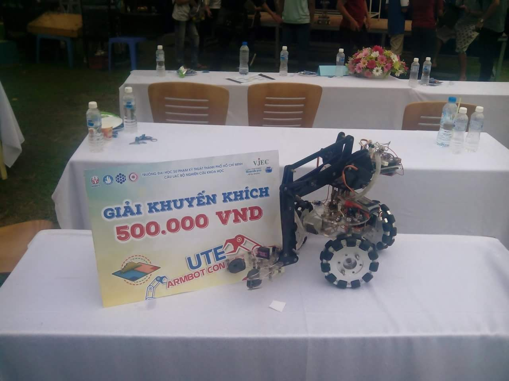
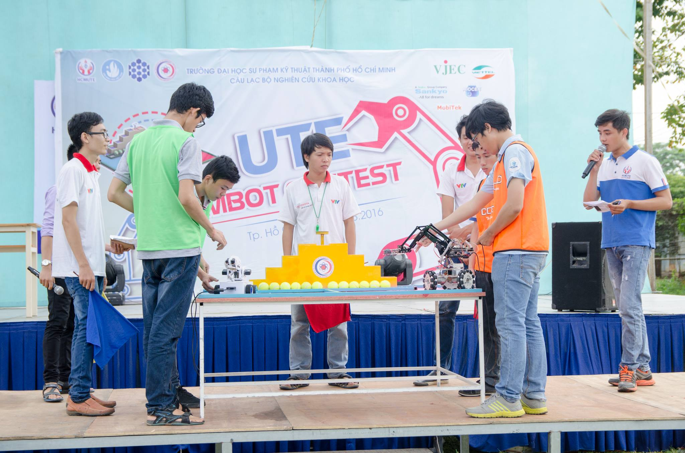
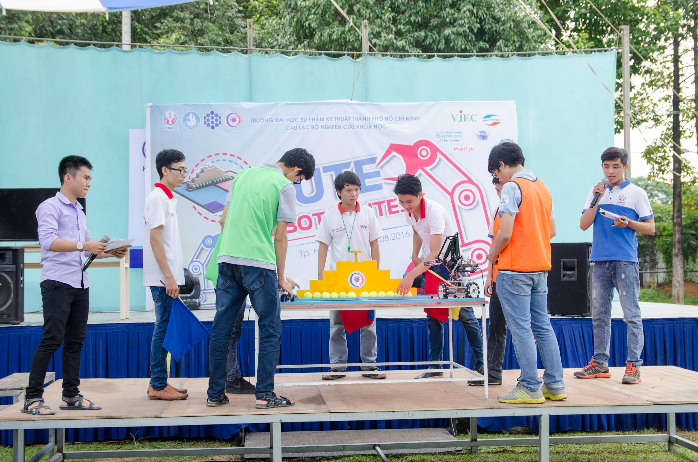
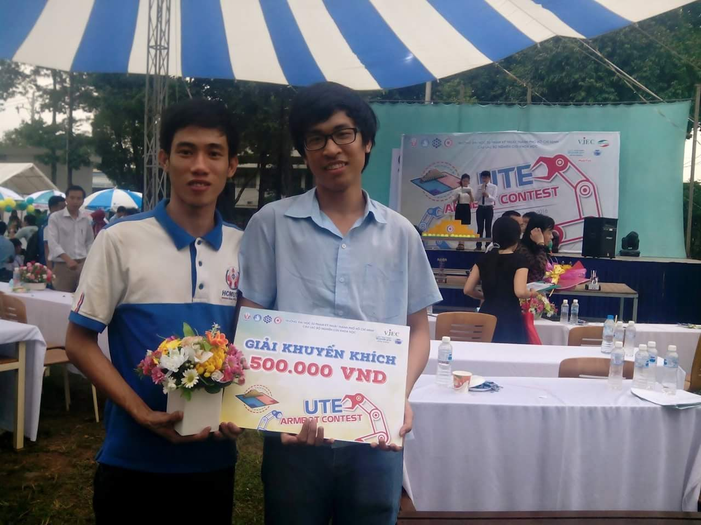

The contest was to make a mobile robot with arm in order to grasp the balls and arrange them on a pyramid

-   Using 3 omnidirectional wheels for **holonomic driving**
-   **Parallel robot arm's mechanism** was used to grasp the objects

    
    
    
    
