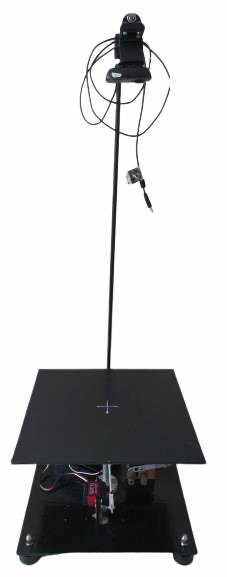
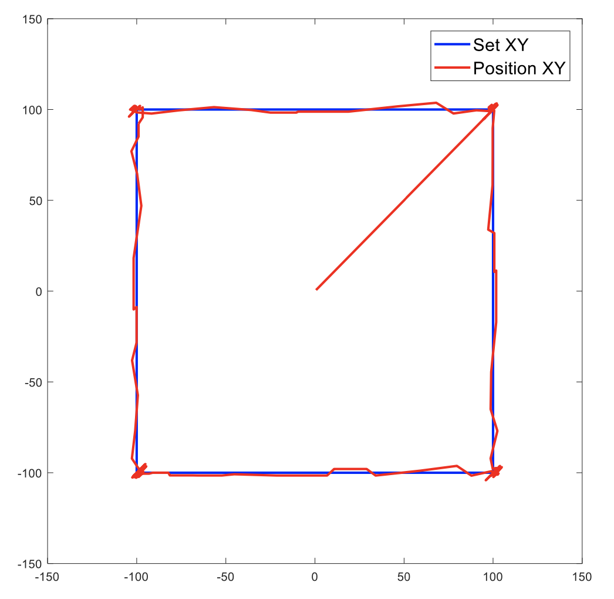
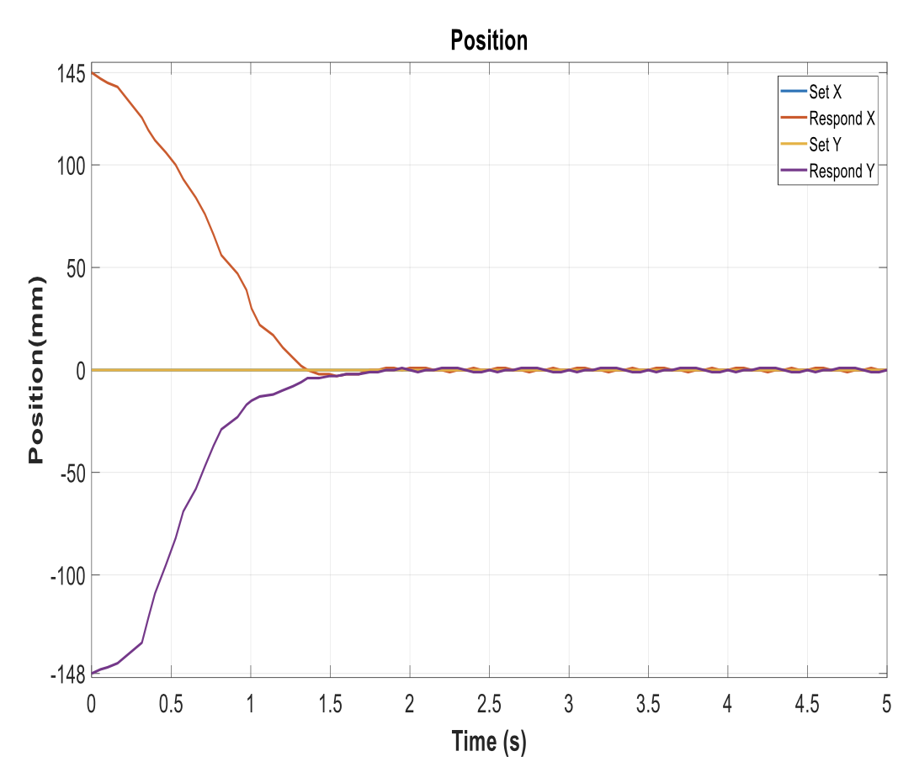
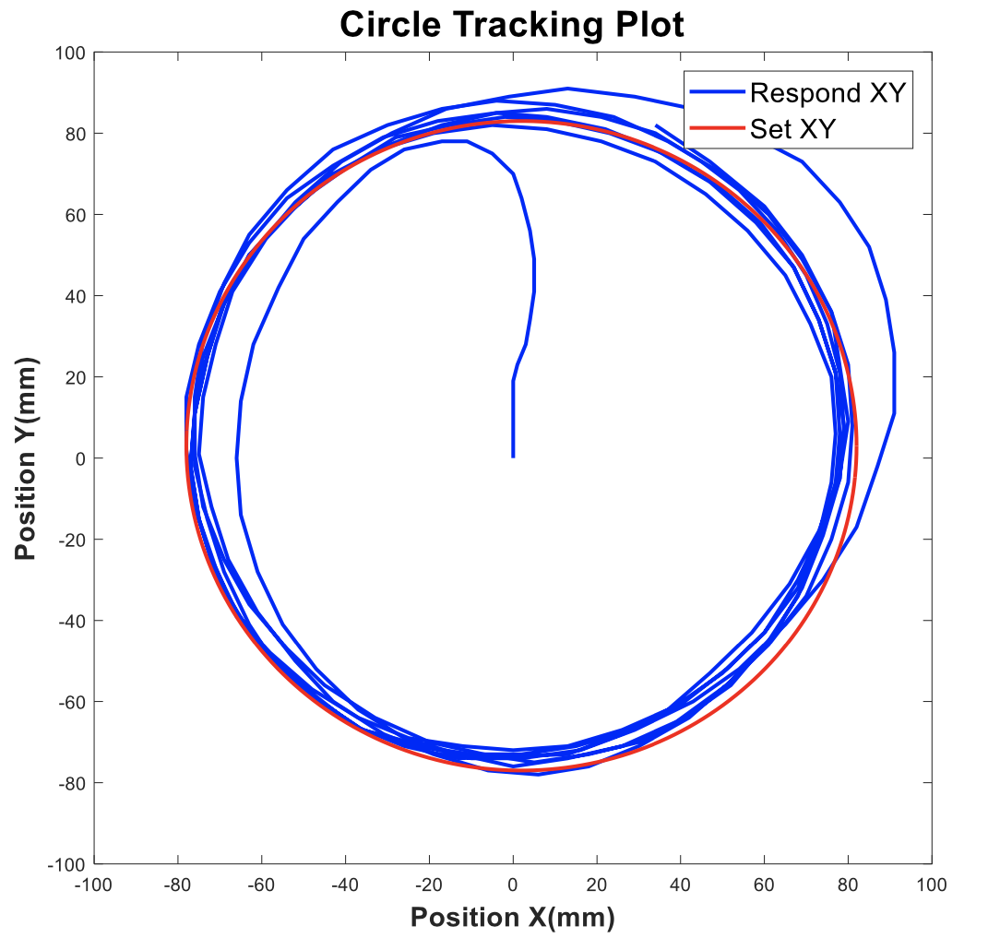
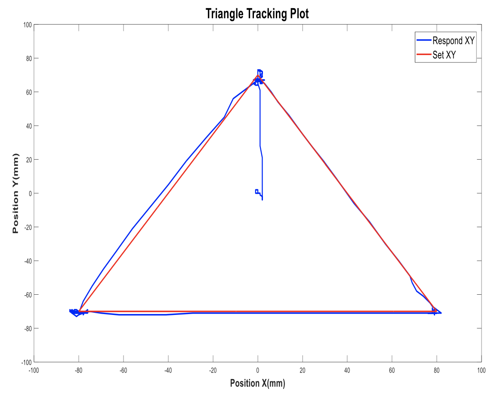

This scientific research project was sucessfully defended with **"Excellent"** grade. Applying Computer Vision-based Tracking and Control theory in order to balance the ball on a plate.

-   Using camera as tracking system and 2-DOF mechanism to control the plate's tilt angle 
    

-   Trajectory plot

    
    
    
    

-   Reference video: [Video](https://drive.google.com/file/d/1iT5R1bOjOyKMIwt4che04ngiKXIv9X_n/view?usp=sharing)