**Micromouse Academic Contest** was hold by **Faculty of Electrical and Electronics Engineering** anually. I attended 3 times through my studies. 

### **New comer**
- The **first one** in my second year was really *tragic*. Battery was placed on top (OMG!) and all the wirings were using connector. Although it was absolute mess, I gained great experience for the next competition.

    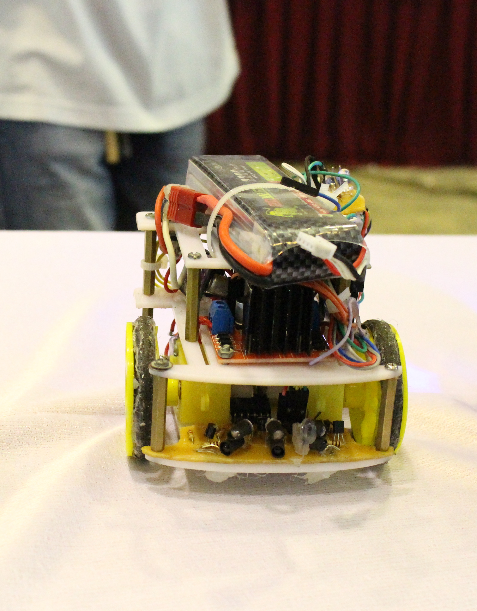
    

### **Experienced One**
- It was completely better in the **second try**. 

    -   The sensors were rearranged, circuit board was carefully designed
    -   Smaller battery was placed at the center of origin
    -   Feedback position using encoder-motor was used for **floodfill** algorithm
    -   Better tuning strategy for PID control

    Fortunately, I **won** the contest.

    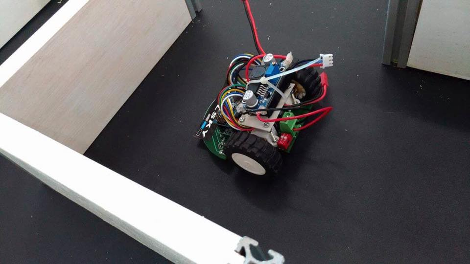
    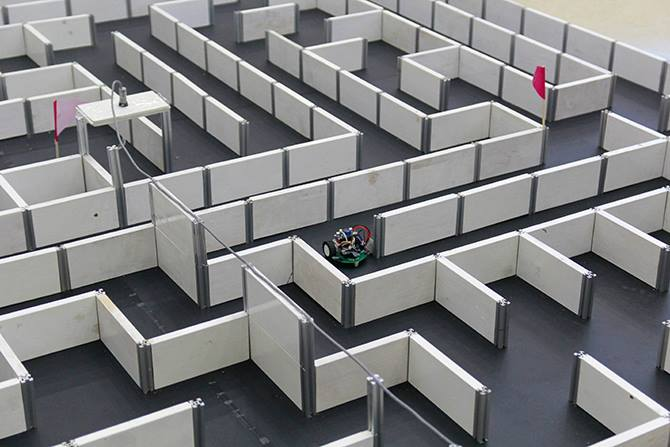
    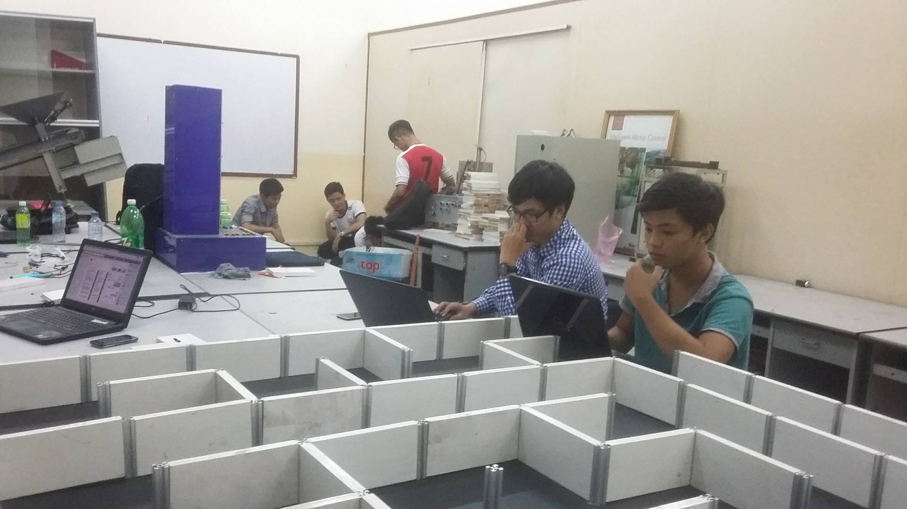
    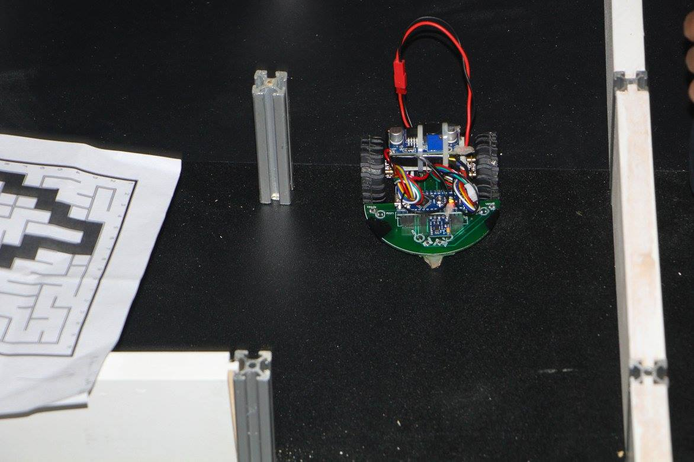

    More pictures please...

    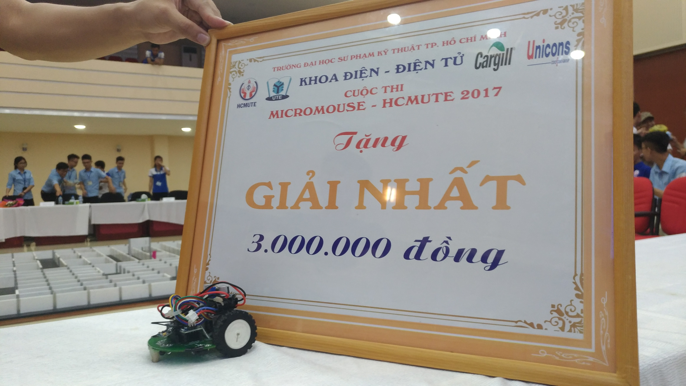
    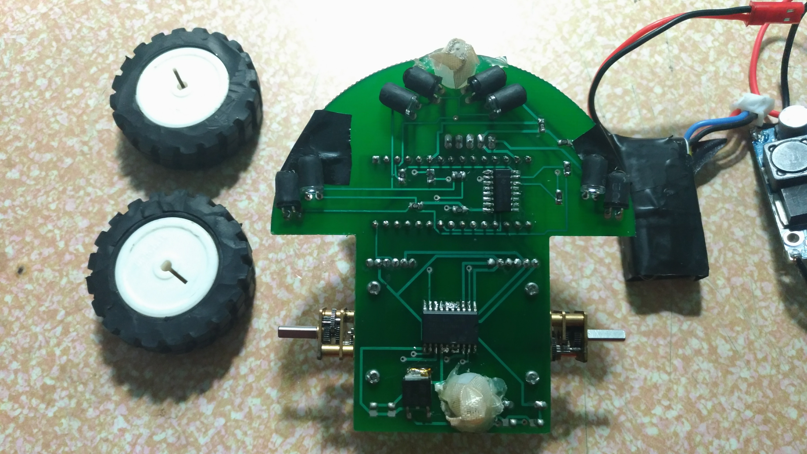
    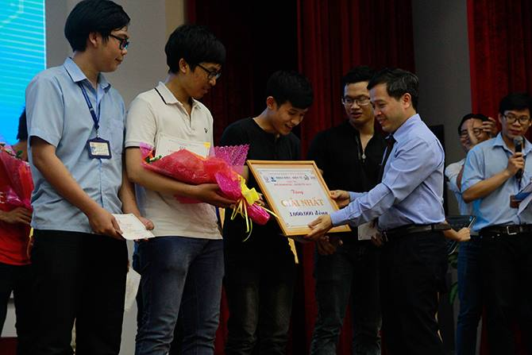
    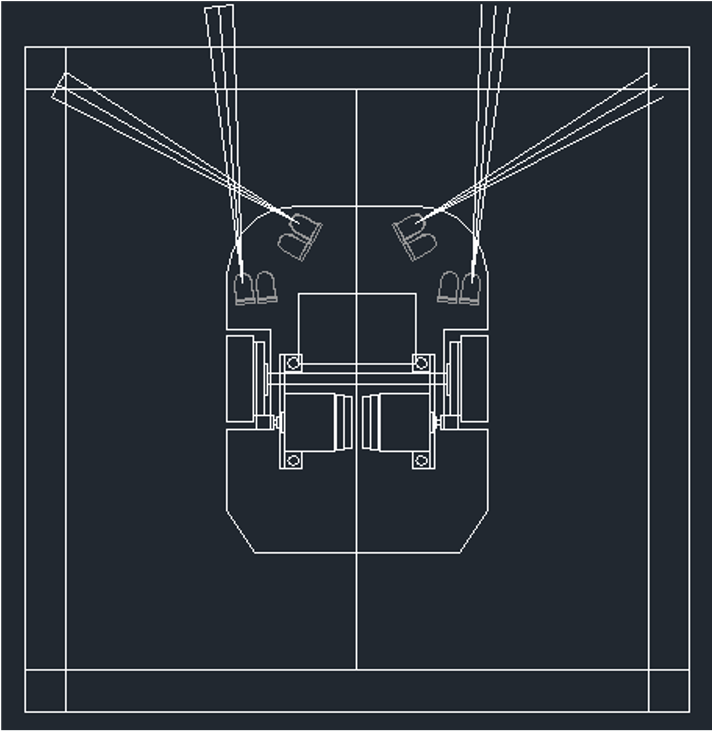

## **Sharing knowledge**
- The third one I joined was as a **trainer** as I always love sharing knowledge with others. The knowledge-sharing class was very crowded.

    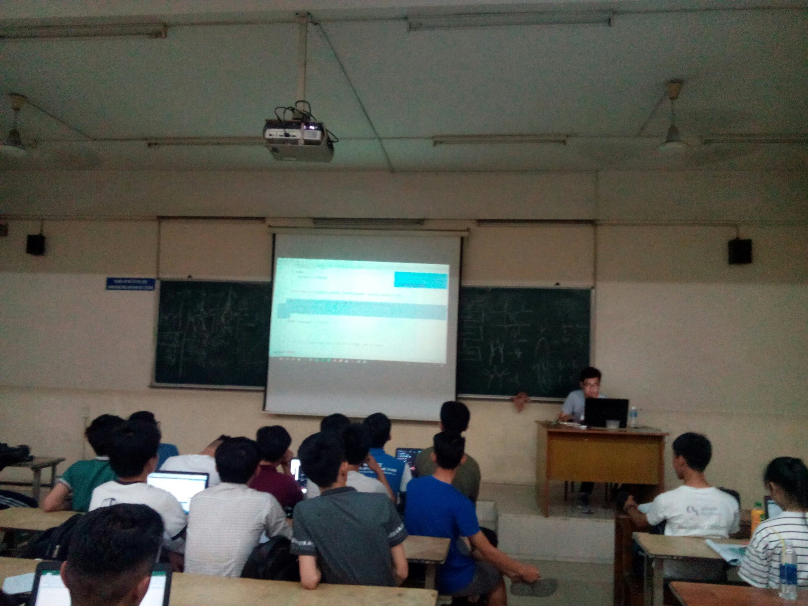
    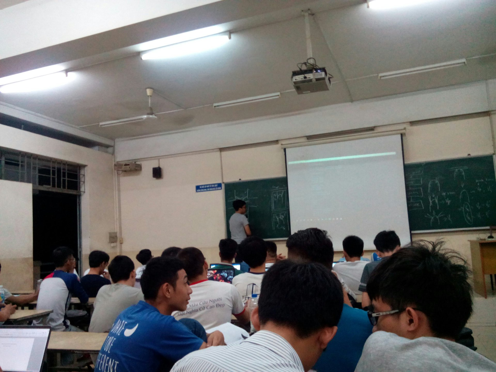
    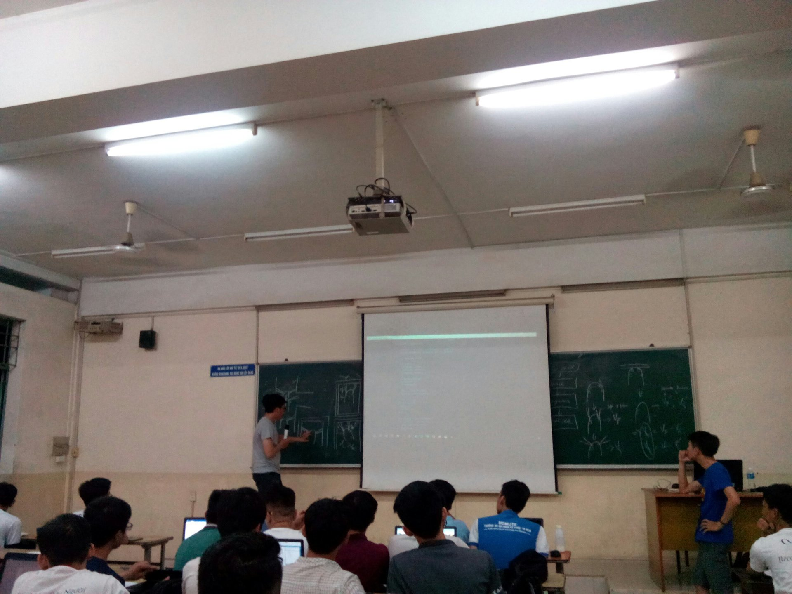
    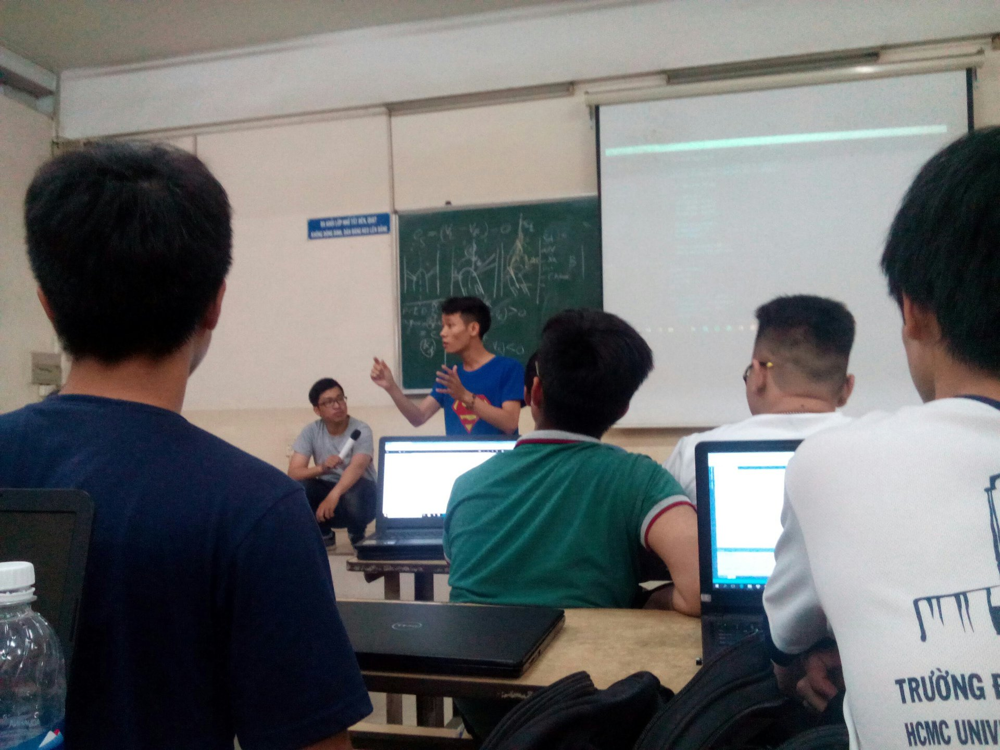
