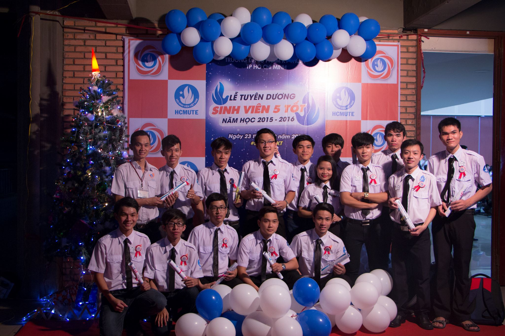
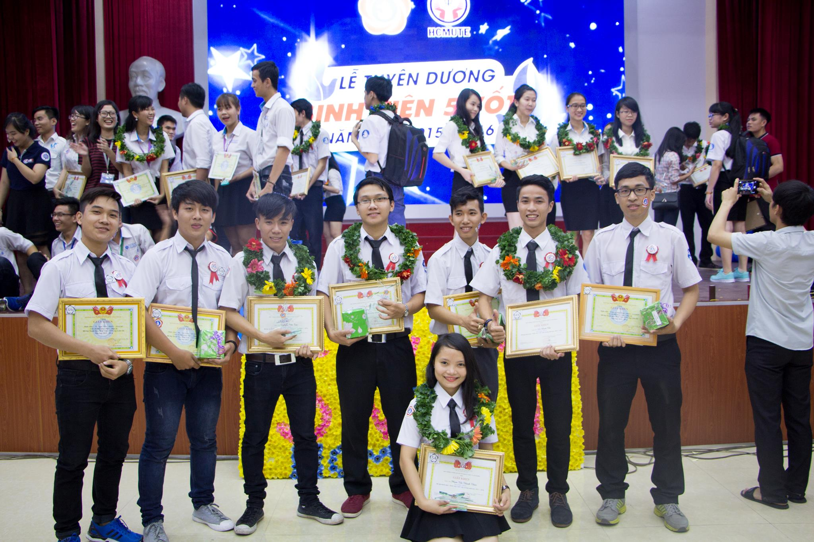
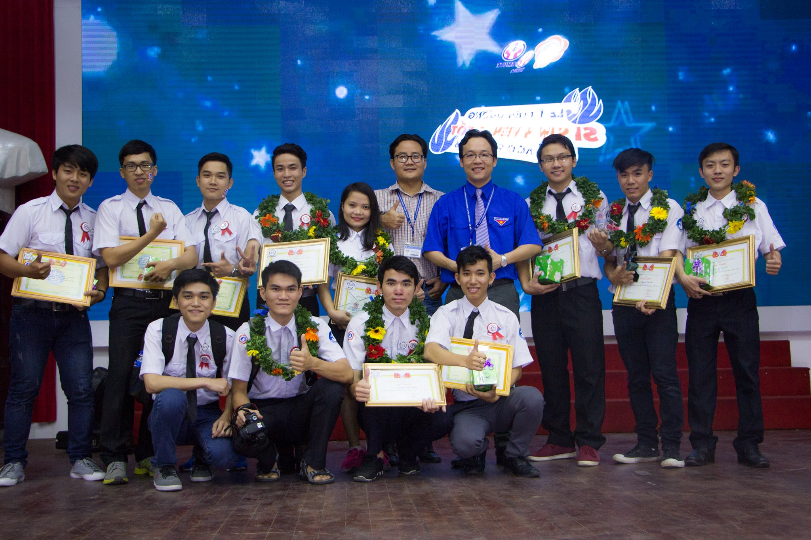

This title **"Students With Five Good Merits"** was first introduced by **Vietnam's Student Association** and soon became the title students nationwide attempt to achieve. The 5 criteria of the title include good ethics, good learning, good physical strength, good volunteer and good integration.

