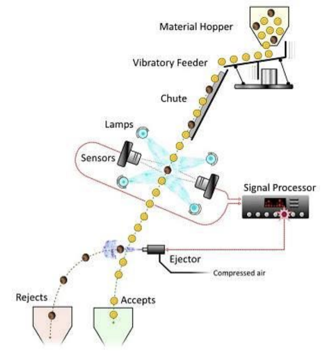
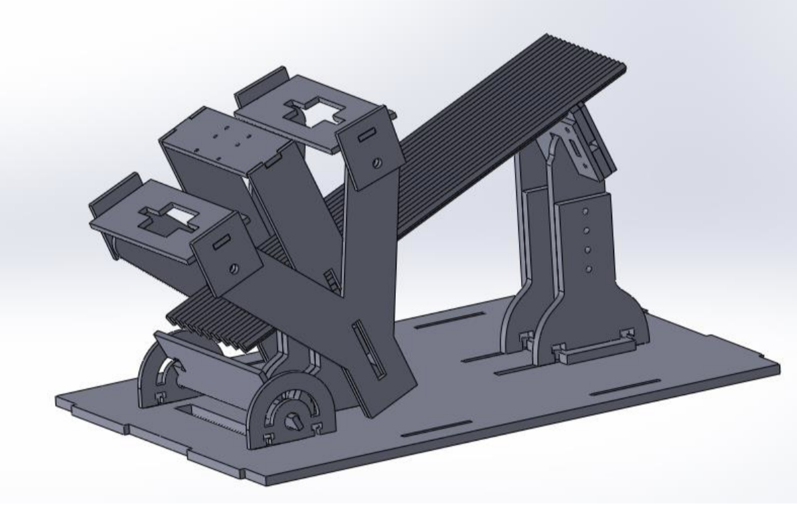
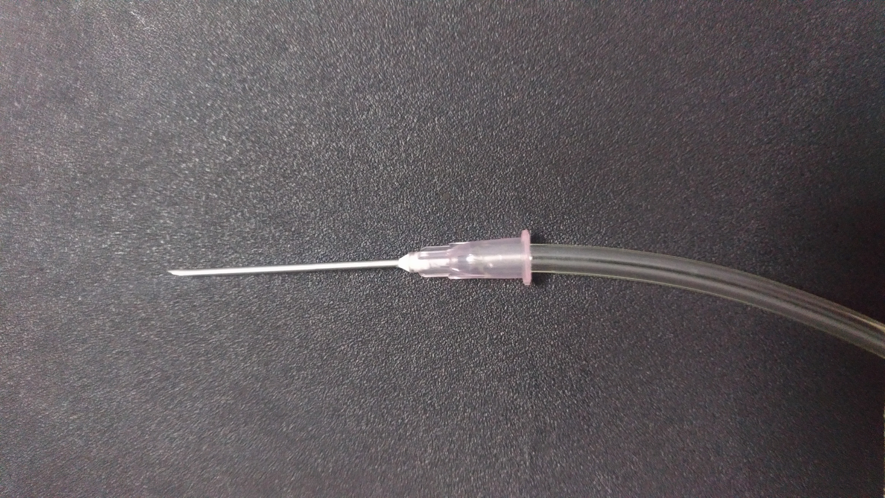
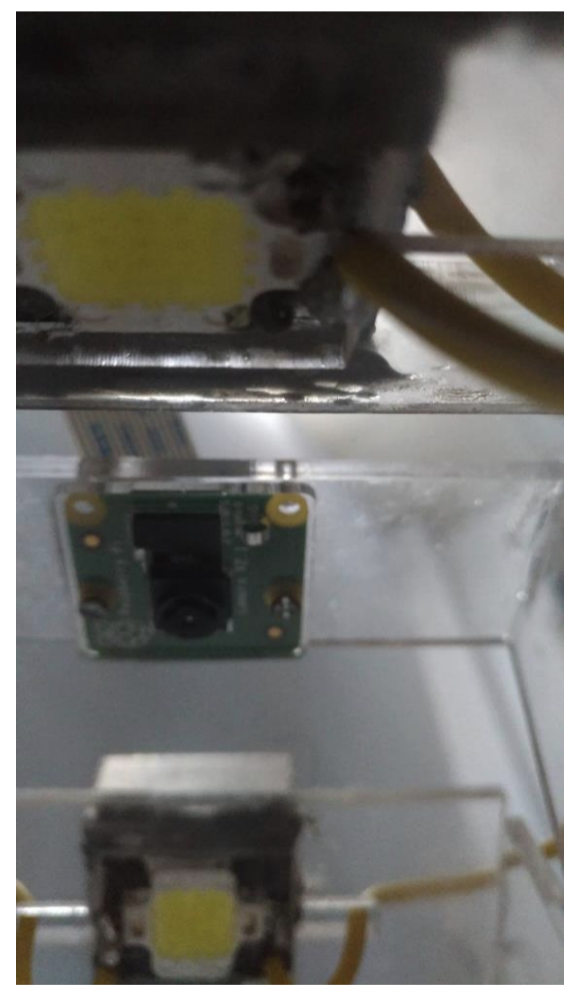
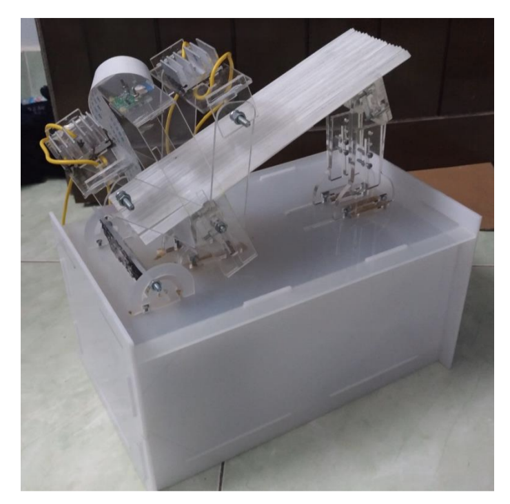

-   The goal of my Bachelor thesis is to research and implement a **classification model** using multi-layer perceptron on the images of coffee beans and carry out the concept of a machine that could physically classify good and defective beans into different baskets **on the fly**. The rejection of bad quality beans would increase the overall quality of agricultural produce.
       
    

-   Regarding general ideas, a system is constructed with a camera to capture multiple coffee beans freely sliding through multiple chutes, leading to trigger actuators, which is a row of air blowers to reject low-quality products based on shape and color. Technically, I implement a program with C++ to embed the code into a **single-board computer called Raspberry Pi** to control a camera for streaming images at **high frame rate** (90 FPS) and low resolution. Furthermore, to achieve this circumstance, I designed a lighting system to feed an intense lighting resource to a high-speed camera with low-exposure setting. 

-   Since real-time running was important for categorizing coffee beans, there were many concerns related to software optimization, classification performance, movement estimation’s precision, actuators’ response time. The whole process needed to execute around 6 frames of image string to track the movement of the objects. Firstly, images in RGB color space were converted into HSV color space, getting a saturation layer to remove shadow from the lighting source. I applied Gaussian correlation filtering to degrade noise in the image, subsequently the Otsu algorithm was implemented to perform unsupervised segmentation on gray image. Then, I used morphological operations and heuristics methods to finally output the locations of the beans in the image. Regarding classification model, I used Multi-layer Neural Network to classify inputs, which were **Regions of Interest** (RoI) from the previous process. The images with the size of 15x15 in each ROI were flattened into a vector of 625 elements, followed by passing them into a trained model. The network architecture was composed of 1 input layer, 3 hidden layers with ReLU activation, and 1 output layer with sigmoid activation. To optimize the model training process, **SGD algorithm** was applied at the stage of backpropagation. 

    - Mechanical design
    

    - One of the air blowers
    

-   Furthermore, my system was designed to handle **multiple object tracking** (MOT) problems by using Kalman Filter algorithm. For details, after the localization of the coffee beans’ locations, **mono-directional and constant velocity motion models** were initiated. The states of coffee beans were tracked in the current frame, and estimated their future positions in the next frame. To ensure the correctness, all frames’ position coordinates (blowers, camera) are **calibrated**. The relative position between the camera and the chutes was defined by detecting an AR marker placed on the chutes, and the position between blowers and the **AR marker** was physically measured. Finally, the relative position between the camera and the blowers was calculated by simple transformation relation. There are fair results achieved, with the classification model’s metrics was based on F1 score, with precision and recall were **87.8%** and **92%** respectively and F1 score was **89.3%**. The successful rejection rate achieved **78 out of 100** shooting attempts. 

    
    