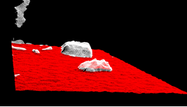
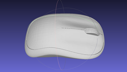

_\*The current team is still putting their effort on developing this one, hence many information will be censored_

This was one of the most intriguing products I have been through. Acting as **a team leader** in this T\*M\* project, I gained valuable knowledge in leadership as well as wide-ranged exposure to robotics development.

## **Hardware Design**
The first one is always messed up in every project, but we can gained a lot of things. Our first ambition: replacing operators in the factory using robots, which is an humanoid one, with perception and actuator system to perform specific tasks. The robot consisted of 6 Degrees of Freedom (DOFs) Arm and 5-DOF Hand, operating based on the response of the Computer Vision system. 

#### **First design**

- Drawbacks
    
    -   Using many simple gear tranmission (spur gear, bevel gear) and belt driven gear, making the system insufficient for the industrial requirements
    
    -   Using different communication interfaces - RS232, RS485, CAN, EtherCAT. This made the actuator synchronization became close to impossible.

    
    

- What have I learned?
    
    -   Time management and planning mindset, as we overdued many times.

    -   Optimal mechanism: using more efficient and high ratio tranmission, as well as different type of motor

    -   Communication interface: EtherCAT was chosen for its performance in speed and synchronization.

#### **Second design**

-   After the first version, we decided to move forward on elegant and compact design. Based on harmonic drive and brushless motors, the requirement could be achieved. 

    
    

-   The actuator consisted of four parts: harmonic gear, brushless motor, magnetic absolute encoder and custom-made controller with EtherCAT interface

    
    

## **Perception System**

-   The behavior planning process of the robot was based on Hierarchical State Machine, where each high level scenario comprised low-level state machines. All position coordinates were linked by implementing the hand-eye calibration technique of **“Real Time Versatile Robotics Hand/Eye Calibration using 3D Machine Vision”** from Tsai-Lenz.

-   **Hand-eye Calibration** was implemented in order to link robot's cooridnates (with relative transformation)

    

-   Object Deteciton model - Faster RCNN was deployed into Jetson Xavier for real-time processing

    
    

-   6-DOF Object Localization was implemented using ICP algorithm

    
    
    
    

-   Further step was implemented Dense Fusion for 6-DOF Object Detection
    
    
