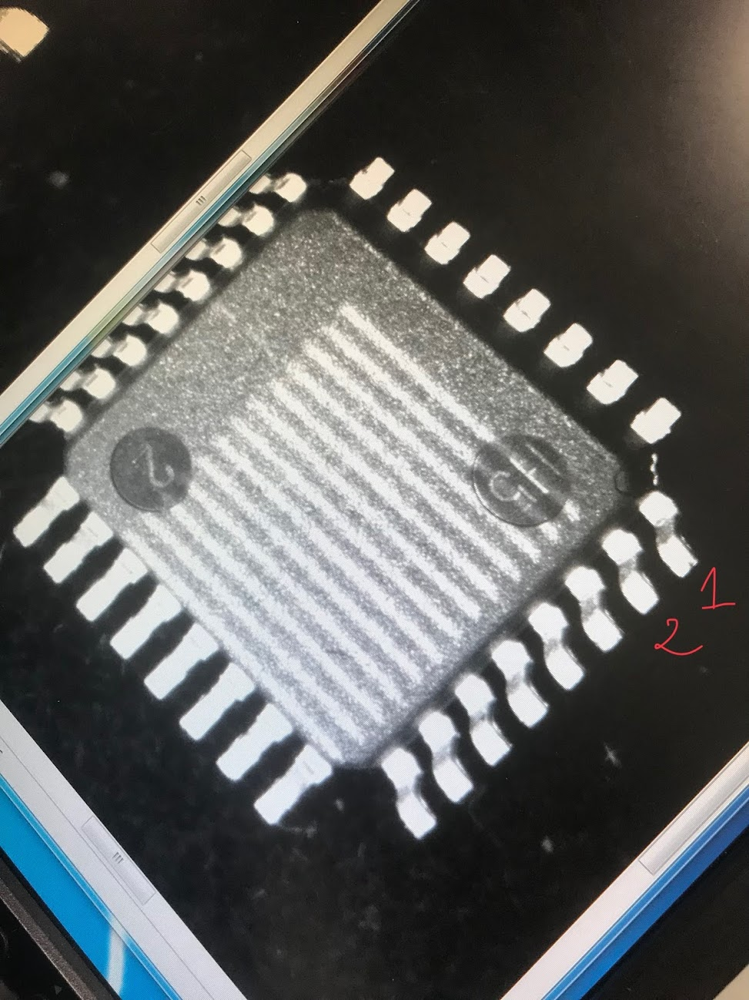
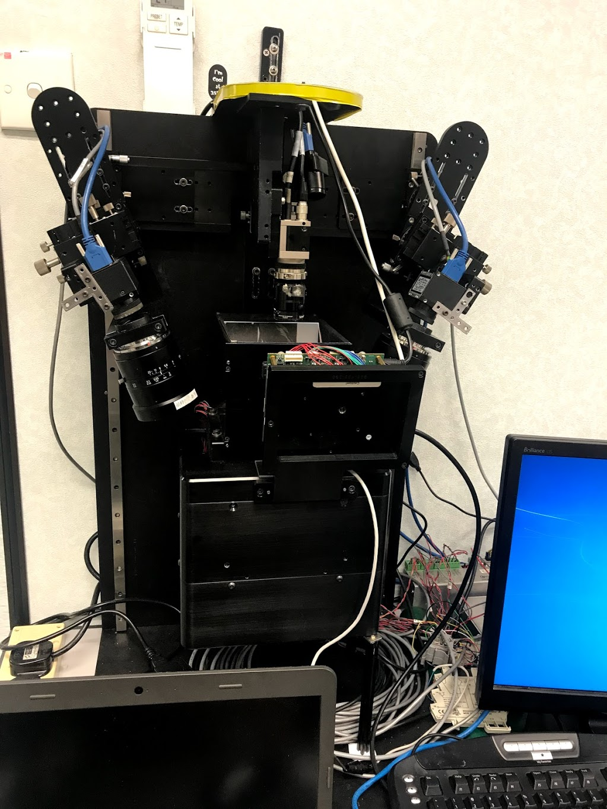
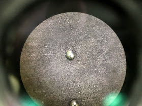
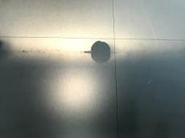

-   This is the project of **“Reconstructing 3D model of Ball Grid Array (BGA) unit using the Tilted-Lens Stereo Camera system”** in order to handle all-round unit measurement. In particular, my main role in this project is to deploy Computer Vision algorithms, and also I had to directly collaborate with hardware engineers from Singapore. 

-   Cameras and Lens models are constructed by traditional camera calibration methods. By having intrinsic and extrinsic parameters of the system, the 3D model of the object can be constructed by **the disparity of corresponding points** on two camera image planes and triangulation of the stereo camera system. For each unit, there are a unit's surface and balls placed on top of the surface. The surface’s 3D plane model is estimated by the **RANSAC algorithm**, sampling the feature points laid on the surface. 3D points on top of the balls are estimated by fitting feature points into the circle using Hough Transform. 

-   Finally, the distances from points to planes are computed by the projection of 3D points onto a single 3D plane. The project successfully met the requirements, with the **measurement’s repeatability smaller than 10 microns and accuracy being about 15 microns**. Undergoing this project gave me a strong foundation on Computer Vision and 3D Reconstruction, as well as being well-established knowledge of camera models and lens calibration.

    
    
    
    

