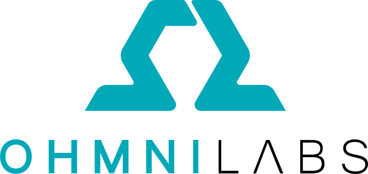
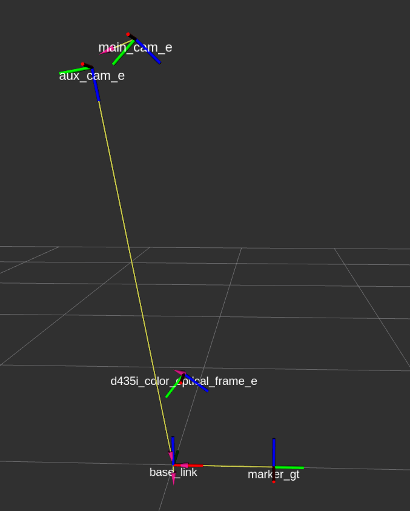
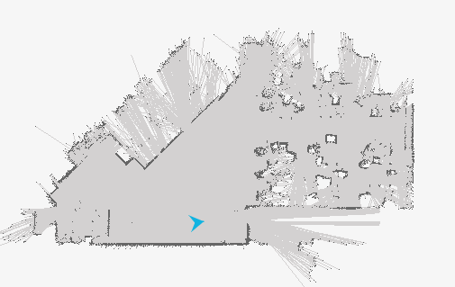
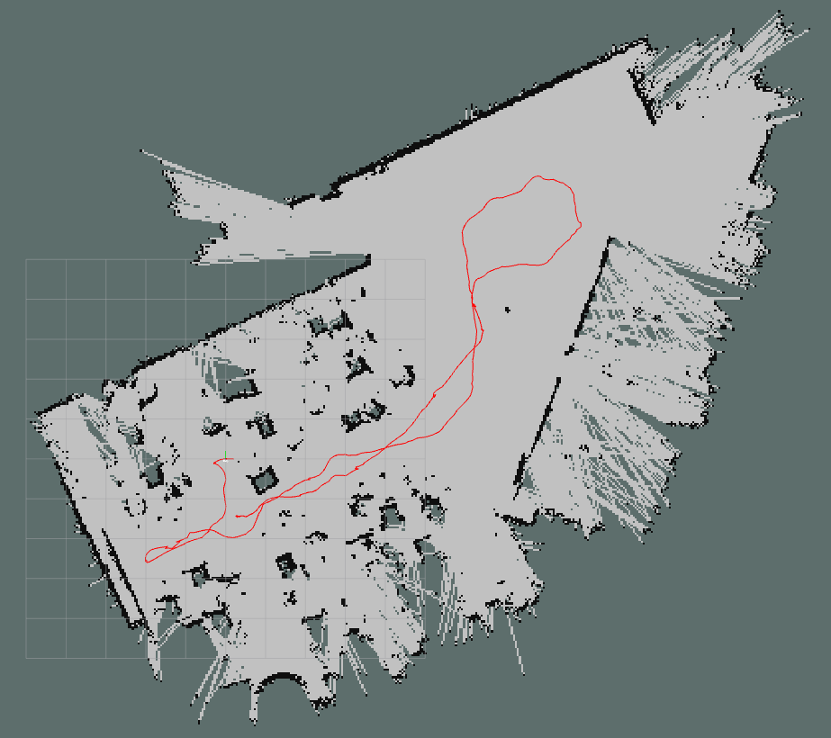

I have worked in U.S startup company - **Ohmnilabs**, developing autonomous capabilities for the exisitng telepresence robots. It was fascinating jobs and I got exposed to the field that I incline towards: Simultaneous Localization and Mapping (SLAM), and Scene Understanding in Autonomous Vehicle.

-   *Visual Driving Assistance*: [Video](https://drive.google.com/file/d/1sY0lrWbme8ve8xA8vli0VktBkuMlNP5_/view?usp=sharing)

-   *Autonomous Map Exploration*: [Video]( https://drive.google.com/file/d/1vwNI_wxoF7F7BSNCMJCHho6hVJJ-fz_2/view?usp=sharing)

-   *Multi-frame Calibration*

    

-   *Lidar-based SLAM*

    

    

